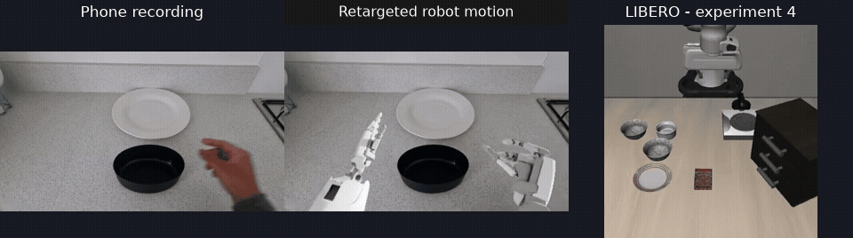

# Learning from Ego

**Does training on human videos improve a VLA's performance after fine-tuning
on robot demonstrations?**

At home, I used my smartphone to record first-person (egocentric) videos of
myself picking up a bowl and placing it on a plate. I converted these recordings
into robot images and movement data to train a vision-language-action (VLA)
model, which takes images, an instruction and the robot's state to predict actions.

[View my original smartphone recordings on Google Drive](https://drive.google.com/drive/folders/1_qfCVt0DsNNct47sBkigbv2mTtqOswg7?usp=sharing).

With only 5 days for this, I focused on a small investigation into whether 
human videos could help a robot learn a bowl-placement task. I used an affordable 
cloud GPU to meet the 24 GB VRAM requirement and kept the total GPU rental cost 
to $9.67, equivalent to about 38 GPU hours of processing, training and fine-tuning.

## Demo

From left to right: my phone recording, the same segment with generated robot
motion, and a separate successful robot attempt from the initial experiment.
The clips are not synchronised, and the LIBERO rollout appears faster than the other two.

## Approach

The **embodiment gap** is the difference between how humans and robots move.
A human hand and a robot gripper can perform the same task, but their joints
and controls differ, so the recorded movements need to be adapted for the robot.

I use HuRo for **retargeting**, which translates human movement into robot
movement by estimating hand and camera motion, converting it into the Allex
robot's joint positions, and rendering the robot in my recorded scene.

1. **Record the task.** I use my smartphone to film myself picking up a bowl
   and placing it on a plate from a first-person perspective.
2. **Generate robot data.** HuRo estimates my movements and renders the Allex
   robot in the recorded scene, producing images, instructions and joint positions.
3. **Pre-train the VLA on human-derived data.** Starting from SmolVLA base, I
   train the model to predict the next frame's 22 right-arm and finger joint
   positions from the current image, instruction and joint positions, using
   labels estimated by HuRo rather than measured from a physical robot.
4. **Fine-tune on LIBERO robot demonstrations.** LIBERO is a simulated robot
   benchmark, and its demonstrations teach the model to control that robot
   using its camera views, state measurements and action commands.
5. **Evaluate task success.** I run the fine-tuned model in LIBERO and count
   how often it successfully places the bowl on the plate.

Note, lerobot/smolvla_base is the general pre-trained base model, which is not yet fine-tuned on LIBERO demonstrations.

## Dataset and tasks

### My smartphone recordings

I recorded **15 videos** using the same bowl and plate in different positions.
The first three recordings were used for an initial experiment, followed by
12 more recordings with varied layouts.

| Human dataset | Usable recordings | Training frames |
|---|---:|---:|
| Original three videos | 3 | 506 |
| All 15 videos processed again | 14 | 2,761 |

One recording was absent from the prepared output. I kept the longest segment
from each usable recording to avoid including overlapping segments twice.

### Original LIBERO robot demonstrations

For robot fine-tuning, I use the original LIBERO Spatial demonstration dataset,
which contains recorded robot camera views, states and actions in HDF5 files.
These demonstrations are separate from my smartphone recordings and the data
HuRo generates from them.

| LIBERO task ID | Description |
|---|---|
| 0 | Pick up the black bowl between the plate and the ramekin and place it on the plate. |
| 2 | Pick up the black bowl from the centre of the table and place it on the plate. |
| 8 | Pick up the black bowl next to the plate and place it on the plate. |

A ramekin is a small dish. Each selected task's HDF5 file contains **50 robot
demonstrations**. In the initial study with my 3 egocentric videos for pretraining, I used only task 0's file for fine-tuning
and evaluated on task 0. In the later study using all 14 egocentric videos for pretraining, I combined the files for tasks
0, 2 and 8 into **150 robot demonstrations**, fine-tuned on that combined dataset,
and evaluated each of those three tasks.

## Experiments

The main comparison is **03: Robot-only** against **04: Human video then robot**.
Both start from the same base VLA, SmolVLA base, and use the same LIBERO
robot data for fine-tuning. Experiment 04 adds the human-data pre-training stage which pretrains on the retargetted data.

| Experiment | Starting model | Human-data pre-training | LIBERO fine-tuning | Training or evaluation |
|---|---|---|---|---|
| 01: Hand-coded baseline | None | No | No | Fixed task-0 movement sequence developed by trial and error |
| 02: Published LIBERO model | `HuggingFaceVLA/smolvla_libero` | No | No | Evaluation without additional training (inference only on paper model) |
| 03: Robot-only | `lerobot/smolvla_base` | No | Yes | Fine-tuning on LIBERO robot demonstrations |
| 04: Human video then robot | `lerobot/smolvla_base` | Yes | Yes | Human-data pre-training followed by LIBERO robot fine-tuning |

The Yes/No columns describe training I performed in this project. Experiment
02 uses the original model already fine-tuned on LIBERO by its authors and serves as a reference.
Experiments 03 and 04 use batch size 16 and training seed 42, with matching
robot fine-tuning settings.

Each task is evaluated over **50 episodes**, using a different seed
for each episode, starting at **42** and ending at **91**. The same seed sequence
is used across experiments, with a maximum of **342 actions per episode**. This action limit matches the hand-coded
baseline and differs from the default LIBERO Spatial evaluation limit
(**280 actions per episode in the LeRobot version used here**).

## Results

### Three videos, one task

For **03: Robot-only**, I started from SmolVLA base and fine-tuned it for
2,000 steps on the 50 original LIBERO demonstrations of task 0.
For **04: Human video then robot**, I first trained SmolVLA base for 500 steps
on the data generated from my original three videos, then fine-tuned that
checkpoint on the same 50 LIBERO demonstrations for the same 2,000 steps.
Both models were evaluated on task 0.

| Experiment | Successes | Success rate (Task 0 only) |
|---|---:|---:|
| 01: Hand-coded baseline | 36/50 | 72% |
| 03: Robot-only | 41/50 | 82% |
| 04: Human video then robot | 44/50 | **88%** |

Overall success was improved using a smaller set focused on one specific libero task.

### Larger dataset, three tasks

For experiment **03: Robot-only**, I fine-tuned SmolVLA base for 6,000 steps total on
the combined 150 original LIBERO demonstrations from tasks 0, 2 and 8.
For experiment 04: Human video then robot, I first trained SmolVLA base on the retargeted data
from my 14 usable recordings, then fine-tuned each resulting checkpoint for
**6,000 steps total on that same combined LIBERO dataset**.

The table shows two human pre-training durations, 500 and 5,000 steps. All
models were evaluated on each of the three tasks. Experiment **02: Published LIBERO model**
was evaluated as downloaded, without either training stage in this project.

| Experiment | Pretraining steps | Task 0 | Task 2 | Task 8 | Overall |
|---|---:|---:|---:|---:|---:|
| 02: Published LIBERO model | None | 68% | 80% | 76% | 74.7% |
| 03: Robot-only | 0 | 80% | 84% | 38% | **67.3%** |
| 04: Human video then robot | 500 | 62% | 86% | 38% | 62.0% |
| 04: Human video then robot | 5,000 | 54% | 76% | 58% | 62.7% |

Human-data training pretraining did not improve overall success downstream.
Other runs with 1,000, 2,000 and 7,000 human pre-training steps also scored
below robot-only training. The published libero model was trained on the entire
libero dataset for all tasks for 20000 steps, a much higher training budget compared
to experiments 03 and 04. 

### Ablations

- Reprocessing the original three videos reduced task-0 success from 88% to 76%.
  Restoring their original instructions gave 78%, and restoring their original
  images as well gave 82% while retaining the reprocessed movements.
- Combining the original three demonstrations with the other new recordings
  gave 55.3% across three tasks, compared with 62.0% for all-reprocessed data
  at the same 500 human and 6,000 robot steps.
- Rewriting instructions to use “bowl” and “plate” consistently gave 50.7% at
  the same number of training steps. The edits also required lifting and placing in every label,
  including one that had previously described only reaching and lifting.

The results suggest that generated data quality matters, but these comparisons
do not establish which processing changes caused the differences. More data,
longer pre-training and simpler instructions did not consistently improve results.

All experiments use one training seed and 50 evaluation episodes per task.

## What I learned

- **Movement learned for one robot did not consistently transfer to another.**
  The human-data stage after retargetting used Allex arm and hand movements, while LIBERO uses a
  Franka Panda arm with a two-finger gripper and a different action format. The larger experiments suggest that this
  pre-training did not provide useful features downstream with no benefit after LIBERO fine-tuning.
- **More human data did not automatically help.** The initial three-video study
  showed an improvement, but human-data pre-training did not beat robot-only
  training overall in the larger three-task study.
- **Reprocessing the same recordings changes the training data.** HuRo generated
  different movement estimates, images and instructions from the same videos.
  The follow-up runs showed that the resulting model could perform differently,
  even with the same training settings.
- **More general instructions did not guarantee better results.** I used “bowl”
  and “plate” consistently and removed colour descriptions to make the
  instructions applicable to different scenes and layouts, but the revised
  instructions reduced success in the run I tested. This was my attempt to make
  the prompts more abstract.
- **Training schedules matter.** A checkpoint halfway through a longer run is
  not equivalent to a completed shorter run because the learning rate follows
  a different schedule in LeRobot. I used separate completed runs when comparing training durations.
- **Good-looking robot videos are not enough to judge the data.** Rendered
  movements can look convincing while still containing errors in the estimated
  joint positions or their alignment with the images.
- **Results need to be examined task by task.** Some human-data runs improved
  task 8 while making tasks 0 and 2 worse, which the overall score alone would
  not explain.

## Setup

See [setup and running](docs/setup.md) for dependencies, dataset preparation,
training and evaluation commands, and the [HuRo guide](docs/huro_pilot.md) for
processing phone recordings.

## Where I used AI

I wanted to focus my time and energy on research, reading papers, and creative problem-solving. I offloaded the mundane tasks to AI. Specifically, I used AI to help with installation commands (on Linux), troubleshoot dependency and environment issues, setup documentation, and tidying up my code. This was helpful when configuring the cloud GPU environment and documenting the project setup for reproducibility. This allowed me to spend more time recording videos/data, coding, tuning/running experiments and reviewing results.

## References and acknowledgements

My work connects existing reconstruction, retargeting, training and simulation
tools into an experiment using my own recordings. I compare additional VLA
training on those recordings followed by robot fine-tuning against robot-only
fine-tuning.

- [SmolVLA paper](https://arxiv.org/abs/2506.01844)
- [LeRobot](https://github.com/huggingface/lerobot)
- [HuRo: Robotizing Human Videos for Scalable VLA Pretraining](https://arxiv.org/abs/2609.10706)
- [LIBERO: Benchmarking Knowledge Transfer for Lifelong Robot Learning](https://arxiv.org/abs/2306.03310)
- [MANO](https://mano.is.tue.mpg.de/): hand models used in reconstruction
- [EgoVLA paper](https://arxiv.org/abs/2507.12440)

See each project's licence for usage terms, including HuRo's third-party dependencies.
